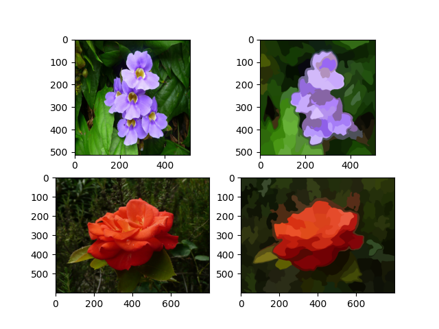

# Colorization adn color transfer using optimal transport

The repo is under construction, only the color transfer without constraints is available at the moment.

## Reqirements

The code works with `Python3.7` and requires the following librarires:

```
matplotlib==3.3.3
numpy==1.19.5
POT==0.7.0
scikit-image==0.14.2
```

To install all the needed libraires, run the following command:

```python
pip install requirements.txt
```

## Color transfer without constraints

This implementation is based on "Adaptive color transfer with relaxed optimal transport" by Rabin et. al.

### Running the code

To perform optimal transfer, run the following command:

```python
python main.py --image_u='path/to/source/image' --image_v='path/to/destination/image'
```
There are other optinal options you might want to use to adapt the code to your case:
```
--segments, an integer which is the approximative number of desired clusters, default is 120
--radius, an integer which is the size of the radius filtering window, default is 1.
--epsilon, a float which is the regularization parameter for post processing, default is 0.01
--iterations, an integer which is the number of iterations of the guided filter for post processing
```

### Superpixel segmentation

The first step is to segment an image into the desired number of superpixels. The `slic` algorithm from `scikit-image` was used to achieve this task. In this example 120 clusters were used. This figure illustrates the original source (u) and destination (v) images and their segmentation into superpixels.



### Clusters transport

Once the image is segmented into superpixels, the next step is to find the best matching between the clusters X of image u and the clusters Y of image v. The basic optimal transport algorithm is used to achieve this task. This figure illustrates the new clusters of image u after optimal transport


### Image synthesis and post processing

To recover geometrical information of image u, the likelihood of each pixel of original image u to the new clusters is estimated. Because this process implies a loss of sharp details, the guided filter of "Guided Image Filtering" by He et. al. is used as post processing. This figure illustrates the image synthesis before and after post processing.


### Reproduce this example

To reproduce this example, run the following command:

```python
python main.py --image_u='examples/fleur-2.jpg' --image_v='examples/fleur_4.jpg'
```

## Color transfer with constrains

In process

## Colorization

The colorization is experimental at the moment.


